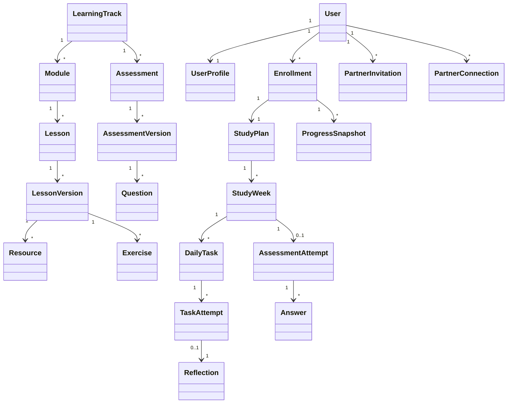

# Domain Model

## Ubiquitous Language

| Term | Meaning |
| --- | --- |
| Learning Track | A predefined long-running programme, such as Software Engineering, Project Management, or German. |
| Module | Ordered group of Lessons inside a Learning Track. |
| Lesson | Reusable learning unit. |
| Lesson Version | Immutable content version used for scheduling and completion snapshots. |
| Enrollment | A learner's participation in one Learning Track. |
| Study Plan | Configured schedule for an Enrollment. |
| Study Week | Calendar-bounded planning unit containing Daily Tasks and one Weekly Assessment opportunity. |
| Daily Task | Scheduled instance of a Lesson for one learner on one date. |
| Task Attempt | Learner's submitted evidence and completion record for a Daily Task. |
| Learning Reflection | Short learner note after a task or week. |
| Weekly Assessment | Assessment for lessons completed during a Study Week. |
| Assessment Attempt | Learner's submitted assessment instance. |
| Partner Connection | Accepted accountability relationship between two users. |
| Progress Snapshot | Materialized summary used for dashboard and partner views. |

## Aggregates

| Aggregate | Root | Includes | Notes |
| --- | --- | --- | --- |
| Identity | User | UserProfile, sessions, roles | Owns authentication identity and profile. |
| Learning Content | LearningTrack | Module, Lesson, LessonVersion, Resource, Exercise | Admin-managed and versioned. |
| Enrollment Plan | Enrollment | StudyPlan, StudyWeek, DailyTask, TaskAttempt, Reflection | Owns learner schedule and completion. |
| Assessment | Assessment | AssessmentVersion, Question, AssessmentAttempt, Answer | Weekly assessment lifecycle and scoring. |
| Accountability | PartnerConnection | PartnerInvitation, sharing preferences | Owns partner visibility and consent. |
| Progress | ProgressSnapshot | Snapshot fields | Derived from tasks, attempts, assessments, and enrollment. |

## Entities

| Entity | Key Fields | Ownership |
| --- | --- | --- |
| User | id, email, passwordHash, roles, status | Identity aggregate |
| UserProfile | userId, displayName, timeZone, preferences | User |
| LearningTrack | id, slug, title, type, active | Content admin |
| Module | id, trackId, sequence, title | LearningTrack |
| Lesson | id, moduleId, slug, defaultDurationMinutes | Module |
| LessonVersion | id, lessonId, version, status, content, assessmentTags | Lesson |
| Resource | id, lessonVersionId, title, url, type, approved | LessonVersion |
| Exercise | id, lessonVersionId, type, prompt, expectedEvidence | LessonVersion |
| Enrollment | id, userId, trackId, status, startDate, targetOutcome | User |
| StudyPlan | id, enrollmentId, schedulePreferences | Enrollment |
| StudyWeek | id, studyPlanId, weekNumber, startDate, endDate | StudyPlan |
| DailyTask | id, studyWeekId, lessonVersionId, scheduledDate, status | StudyWeek |
| TaskAttempt | id, dailyTaskId, submittedAt, evidence, snapshot | DailyTask |
| Reflection | id, userId, taskAttemptId, studyWeekId, visibility | User |
| Assessment | id, trackId, type | Content admin |
| AssessmentVersion | id, assessmentId, version, status, rules | Assessment |
| Question | id, assessmentVersionId, type, prompt, answerKey | AssessmentVersion |
| AssessmentAttempt | id, userId, studyWeekId, assessmentVersionId, status, score | User |
| Answer | id, assessmentAttemptId, questionId, response, score | AssessmentAttempt |
| PartnerInvitation | id, inviterId, inviteeEmail, status, expiresAt | User |
| PartnerConnection | id, userAId, userBId, status, sharingSettings | Both users |
| ProgressSnapshot | id, userId, enrollmentId, weekNumber, metrics | Derived |

## Value Objects

- EmailAddress: normalized lowercase email with validation.
- TimeZone: IANA time zone string.
- StudyAvailability: day-of-week, preferred time, available minutes.
- DateRange: inclusive start date and exclusive end date for pause periods.
- LessonSnapshot: lesson version fields copied into TaskAttempt.
- AssessmentSnapshot: assessment and question fields copied into AssessmentAttempt and Answer.
- Score: earned points, possible points, percentage, pass flag.
- AssessmentTag: stable topic identifier such as `ts-generics` or `risk-register`.

## State Models

Enrollment statuses:

- DRAFT
- ACTIVE
- PAUSED
- COMPLETED
- CANCELLED

Daily Task statuses:

- PLANNED
- IN_PROGRESS
- COMPLETED
- MISSED
- RESCHEDULED
- SKIPPED
- CANCELLED

Content statuses:

- DRAFT
- REVIEWED
- APPROVED
- ARCHIVED

Partner Invitation statuses:

- PENDING
- ACCEPTED
- REJECTED
- EXPIRED
- REVOKED

Assessment Attempt statuses:

- NOT_STARTED
- IN_PROGRESS
- SUBMITTED
- NEEDS_MANUAL_GRADING
- GRADED
- PASSED
- FAILED

## Invariants

- A User email is unique after normalization.
- A user can have only one ACTIVE Enrollment per Learning Track.
- A Daily Task belongs to exactly one Study Week and one Enrollment through its Study Plan.
- A completed Daily Task must have at least one Task Attempt.
- Completed Task Attempts are append-only except for administrator correction events.
- A required Daily Task cannot be scheduled before required prerequisite tasks are complete or scheduled earlier.
- A Lesson Version used for official scheduling must be APPROVED.
- Official Weekly Assessments can use only APPROVED Lesson Versions and REVIEWED or APPROVED Assessment Versions.
- Partner progress views must use scoped progress data, never raw private records.
- AI output cannot change authoritative content, authorization, scheduling, or objective scoring.

## Domain Events

| Event | Emitted When | Consumers |
| --- | --- | --- |
| UserRegistered | User creates account | Audit, onboarding analytics |
| EnrollmentActivated | Study Plan becomes active | Scheduling, progress snapshot |
| DailyTaskCompleted | Task Attempt is accepted | Progress, assessment eligibility |
| DailyTaskMissed | Task passes due date incomplete | Recovery proposal, progress |
| ScheduleAdjusted | Recovery changes future tasks | Audit, dashboard refresh |
| AssessmentSubmitted | Learner submits answers | Scoring, progress |
| AssessmentGraded | Score finalized | Weak-topic detection, revision |
| PartnerInvitationAccepted | Invitation accepted | Partner connection, audit |
| ContentApproved | Lesson or assessment approved | Scheduling eligibility |

## Domain Diagram

