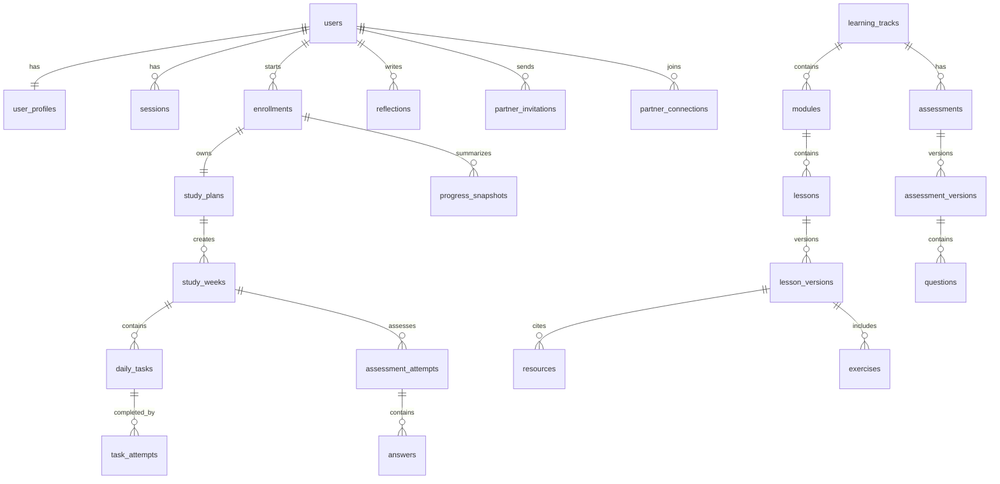

# Database Schema

This document specifies the planned PostgreSQL schema. Do not create Prisma code or migrations until the implementation phase.

## Conventions

- Primary keys: `uuid`.
- Timestamps: `created_at`, `updated_at` on mutable tables; `submitted_at`, `approved_at`, `archived_at`, or `deleted_at` where meaningful.
- Time zones: store user time zone as IANA string; store instants as `timestamptz`; store planned local dates as `date`.
- Soft deletion: use `deleted_at` for user-owned records where audit matters; hard delete only development seed data and expired sessions.
- JSONB: allowed for structured snapshots and provider payloads when versioned and validated by application code.
- Enums: use PostgreSQL enums or Prisma enums consistently.

## Enums

| Enum | Values |
| --- | --- |
| user_status | ACTIVE, DISABLED |
| user_role | LEARNER, CONTENT_ADMIN, SYSTEM_ADMIN |
| track_type | SOFTWARE_ENGINEERING, PROJECT_MANAGEMENT, GERMAN |
| enrollment_status | DRAFT, ACTIVE, PAUSED, COMPLETED, CANCELLED |
| task_status | PLANNED, IN_PROGRESS, COMPLETED, MISSED, RESCHEDULED, SKIPPED, CANCELLED |
| content_status | DRAFT, REVIEWED, APPROVED, ARCHIVED |
| invitation_status | PENDING, ACCEPTED, REJECTED, EXPIRED, REVOKED |
| assessment_attempt_status | NOT_STARTED, IN_PROGRESS, SUBMITTED, NEEDS_MANUAL_GRADING, GRADED, PASSED, FAILED |
| question_type | MULTIPLE_CHOICE, MULTIPLE_SELECT, TRUE_FALSE, SHORT_ANSWER, CODE_CHALLENGE, DEBUGGING_CHALLENGE, SCENARIO, CASE_STUDY, PRACTICAL_ASSIGNMENT, REFLECTION |
| reflection_visibility | PRIVATE, PARTNER_VISIBLE |

## Identity Tables

| Table | Columns |
| --- | --- |
| users | `id uuid pk`, `email text unique not null`, `password_hash text not null`, `status user_status not null`, `created_at timestamptz`, `updated_at timestamptz` |
| user_roles | `user_id uuid fk users`, `role user_role`, primary key `(user_id, role)` |
| user_profiles | `user_id uuid pk fk users`, `display_name text not null`, `time_zone text not null`, `preferred_session_time time`, `created_at`, `updated_at` |
| sessions | `id uuid pk`, `user_id uuid fk users`, `session_hash text unique not null`, `expires_at timestamptz not null`, `created_at`, `revoked_at timestamptz` |

Indexes:

- `users(email)`
- `sessions(session_hash)`
- `sessions(user_id, expires_at)`

## Learning Content Tables

| Table | Columns |
| --- | --- |
| learning_tracks | `id uuid pk`, `slug text unique`, `type track_type`, `title text`, `description text`, `active boolean`, `created_at`, `updated_at` |
| modules | `id uuid pk`, `track_id uuid fk learning_tracks`, `sequence int`, `title text`, `summary text`, `created_at`, `updated_at`, unique `(track_id, sequence)` |
| lessons | `id uuid pk`, `module_id uuid fk modules`, `slug text`, `sequence int`, `default_duration_minutes int`, `difficulty text`, `required boolean`, `created_at`, `updated_at`, unique `(module_id, sequence)`, unique `(module_id, slug)` |
| lesson_prerequisites | `lesson_id uuid fk lessons`, `prerequisite_lesson_id uuid fk lessons`, primary key `(lesson_id, prerequisite_lesson_id)` |
| lesson_versions | `id uuid pk`, `lesson_id uuid fk lessons`, `version int`, `status content_status`, `title text`, `learning_objective text`, `outcomes jsonb`, `explanation_md text`, `relevance_md text`, `examples jsonb`, `common_mistakes jsonb`, `assessment_tags text[]`, `author_id uuid fk users`, `reviewer_id uuid fk users nullable`, `approved_at timestamptz nullable`, `archived_at timestamptz nullable`, unique `(lesson_id, version)` |
| resources | `id uuid pk`, `lesson_version_id uuid fk lesson_versions`, `title text`, `provider text`, `url text`, `resource_type text`, `difficulty text`, `estimated_minutes int`, `description text`, `verification_status text`, `required boolean`, `approved boolean`, `citation text`, `created_at` |
| exercises | `id uuid pk`, `lesson_version_id uuid fk lesson_versions`, `kind text`, `prompt_md text`, `expected_evidence text`, `solution_notes_md text nullable`, `created_at` |
| knowledge_checks | `id uuid pk`, `lesson_version_id uuid fk lesson_versions`, `question text`, `answer_key jsonb`, `explanation text`, `created_at` |

Indexes:

- `learning_tracks(type, active)`
- `modules(track_id, sequence)`
- `lessons(module_id, sequence)`
- `lesson_prerequisites(prerequisite_lesson_id)`
- `lesson_versions(lesson_id, status)`
- GIN index on `lesson_versions(assessment_tags)`

## German Curriculum Architecture Storage

The German curriculum architecture introduces CEFR sublevels, Learning Units, Activities, competency tags, grammar/vocabulary progression, review status, activity priority, and duration-aware session composition.

For the current MVP proof slice, no new tables are required:

- CEFR sublevel is stored as Lesson difficulty and assessment tag values for approved seed sessions.
- German start level, target level, and session duration are stored in `enrollments.learning_preferences`.
- Activity-like learner actions are represented through Lesson Version sections, exercises, knowledge checks, resources, and assessment tags.
- Daily Task `planned_duration_minutes` records the learner-specific composed session duration.

When authoring tooling needs first-class German curriculum records, introduce normalized tables before duplicating 30/45/60/90-minute lessons:

| Future table | Purpose |
| --- | --- |
| `curriculum_levels` | Track CEFR sublevels such as A1.1 through C2.2. |
| `learning_units` | Pedagogical content units inside modules. |
| `learning_activities` | Duration, priority, skill tags, review status, and learner-facing activity material. |
| `competency_tags` | Listening, speaking, reading, writing, vocabulary, grammar, pronunciation, interaction, mediation, pragmatic, strategy, real-world-task. |
| `grammar_concepts` | Introduce/practise/revisit/expand/integrate lifecycle metadata. |
| `vocabulary_domains` | Domain progression and lexical item grouping. |
| `assessment_mappings` | Trace assessment items to taught content, competency, difficulty, and transfer/inference flag. |

## Planning Tables

| Table | Columns |
| --- | --- |
| enrollments | `id uuid pk`, `user_id uuid fk users`, `track_id uuid fk learning_tracks`, `status enrollment_status`, `start_date date`, `target_outcome text`, `experience_level text`, `learning_preferences jsonb nullable`, `created_at`, `updated_at` |
| study_plans | `id uuid pk`, `enrollment_id uuid unique fk enrollments`, `study_days int[]`, `available_minutes_by_day jsonb`, `assessment_day int`, `recovery_day int`, `preferred_session_time time`, `created_at`, `updated_at` |
| pause_periods | `id uuid pk`, `study_plan_id uuid fk study_plans`, `starts_on date`, `ends_on date`, `reason text nullable`, `created_at` |
| study_weeks | `id uuid pk`, `study_plan_id uuid fk study_plans`, `week_number int`, `starts_on date`, `ends_on date`, `created_at`, unique `(study_plan_id, week_number)` |
| daily_tasks | `id uuid pk`, `study_week_id uuid fk study_weeks`, `lesson_version_id uuid fk lesson_versions`, `scheduled_on date`, `status task_status`, `planned_duration_minutes int`, `is_required boolean`, `source_task_id uuid fk daily_tasks nullable`, `reschedule_reason text nullable`, `created_at`, `updated_at` |
| task_attempts | `id uuid pk`, `daily_task_id uuid fk daily_tasks`, `user_id uuid fk users`, `started_at timestamptz`, `submitted_at timestamptz`, `duration_minutes int`, `completion_evidence jsonb`, `lesson_snapshot jsonb`, `created_at` |
| reflections | `id uuid pk`, `user_id uuid fk users`, `task_attempt_id uuid fk task_attempts nullable`, `study_week_id uuid fk study_weeks nullable`, `visibility reflection_visibility`, `body text`, `created_at`, `updated_at` |

Indexes:

- `enrollments(user_id, track_id, status)` with partial unique index for ACTIVE.
- `daily_tasks(study_week_id, scheduled_on)`
- `daily_tasks(status, scheduled_on)`
- `task_attempts(daily_task_id)`

## Assessment Tables

| Table | Columns |
| --- | --- |
| assessments | `id uuid pk`, `track_id uuid fk learning_tracks`, `title text`, `type text`, `created_at`, `updated_at` |
| assessment_versions | `id uuid pk`, `assessment_id uuid fk assessments`, `version int`, `status content_status`, `passing_percentage numeric(5,2)`, `rules jsonb`, `created_at`, `approved_at`, unique `(assessment_id, version)` |
| questions | `id uuid pk`, `assessment_version_id uuid fk assessment_versions`, `type question_type`, `prompt_md text`, `options jsonb`, `answer_key jsonb`, `points int`, `assessment_tags text[]`, `grading_mode text`, `created_at` |
| assessment_attempts | `id uuid pk`, `user_id uuid fk users`, `study_week_id uuid fk study_weeks`, `assessment_version_id uuid fk assessment_versions`, `attempt_number int`, `status assessment_attempt_status`, `started_at`, `submitted_at`, `graded_at`, `score_earned numeric`, `score_possible numeric`, `percentage numeric`, `passed boolean`, `assessment_snapshot jsonb`, unique `(user_id, study_week_id, assessment_version_id, attempt_number)` |
| answers | `id uuid pk`, `assessment_attempt_id uuid fk assessment_attempts`, `question_id uuid fk questions`, `response jsonb`, `question_snapshot jsonb`, `score numeric nullable`, `feedback text nullable`, `grader_type text`, `created_at`, `updated_at` |

Indexes:

- `assessment_attempts(user_id, study_week_id)`
- `questions(assessment_version_id, type)`
- GIN index on `questions(assessment_tags)`

## Accountability and Progress Tables

| Table | Columns |
| --- | --- |
| partner_invitations | `id uuid pk`, `inviter_id uuid fk users`, `invitee_email text`, `invitee_user_id uuid fk users nullable`, `status invitation_status`, `token_hash text unique`, `expires_at timestamptz`, `responded_at timestamptz nullable`, `created_at`, `updated_at` |
| partner_connections | `id uuid pk`, `user_a_id uuid fk users`, `user_b_id uuid fk users`, `status text`, `sharing_settings jsonb`, `created_at`, `removed_at timestamptz nullable`, unique `(user_a_id, user_b_id)` |
| blocked_users | `blocker_id uuid fk users`, `blocked_user_id uuid fk users`, `created_at`, primary key `(blocker_id, blocked_user_id)` |
| progress_snapshots | `id uuid pk`, `user_id uuid fk users`, `enrollment_id uuid fk enrollments`, `study_week_id uuid fk study_weeks nullable`, `planned_count int`, `completed_count int`, `weekly_completion_percentage numeric`, `current_streak int`, `assessment_completed boolean`, `overall_progress_percentage numeric`, `updated_at` |
| audit_events | `id uuid pk`, `actor_user_id uuid fk users nullable`, `event_type text`, `entity_type text`, `entity_id uuid`, `safe_metadata jsonb`, `created_at` |

Indexes:

- `partner_invitations(inviter_id, status)`
- `partner_invitations(invitee_email, status)`
- Partial unique index on pending `partner_invitations(inviter_id, invitee_email)`
- `partner_connections(user_a_id)`
- `partner_connections(user_b_id)`
- `progress_snapshots(user_id, enrollment_id, study_week_id)`
- `audit_events(entity_type, entity_id, created_at)`

## Snapshot Rules

Store immutable snapshots when a learner completes a task or submits an assessment:

- Lesson title, module title, track title, lesson version, objective, outcomes, duration, required flag, assessment tags, and completion evidence schema.
- Assessment version, question prompt, options, answer key reference or scoring rubric version, points, tags, and grading mode.
- Schedule context: scheduled date, study week, and reschedule reason.

Snapshots must not contain secrets, password hashes, session IDs, or unnecessary AI prompt data.

## Deletion Behaviour

- Users are disabled before account deletion is introduced.
- Content is archived, not deleted, once referenced by attempts.
- Daily Tasks and attempts are retained for learner history.
- Expired sessions and expired unaccepted invitations may be purged by maintenance jobs.
- Audit events are append-only.

## Migration Guidance

- Create enums before tables.
- Create identity and content tables before planning tables.
- Create assessment tables before assessment attempts.
- Add indexes in the same migration as dependent queries where practical.
- Backfill snapshot fields before making them required.
- Use transactional migrations for schema changes where PostgreSQL supports them.

## ER Diagram

