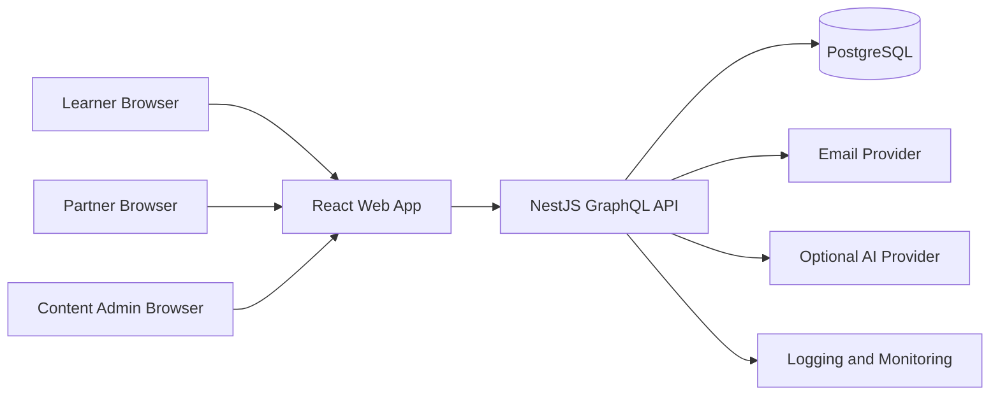
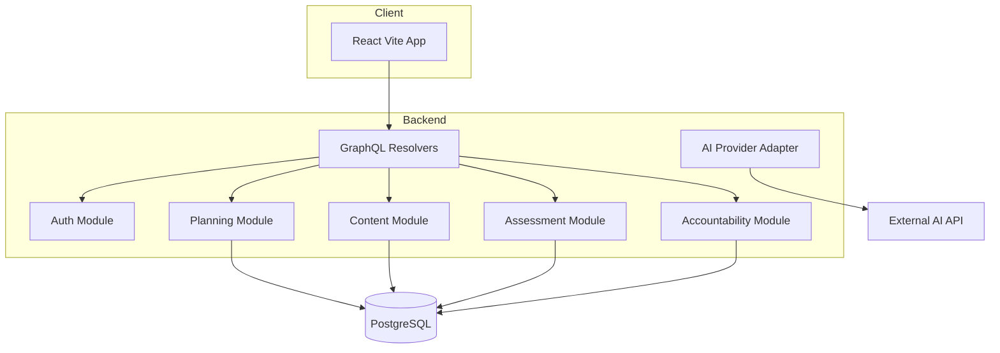
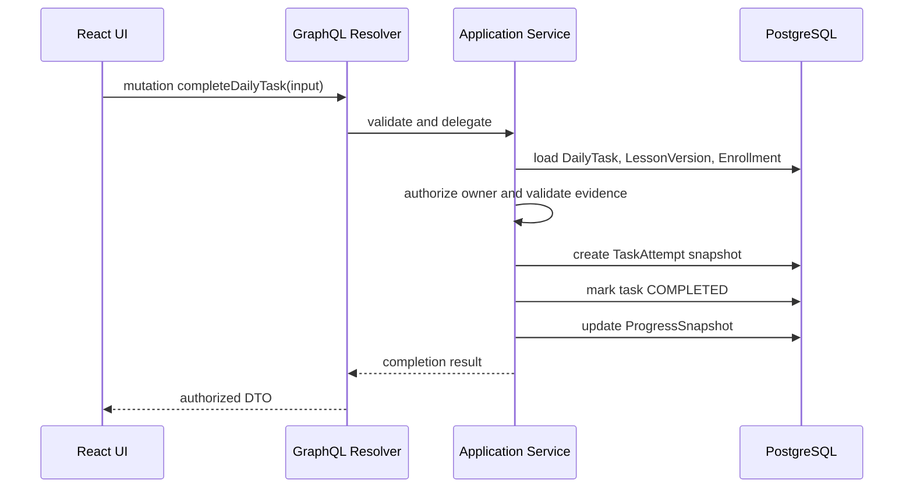
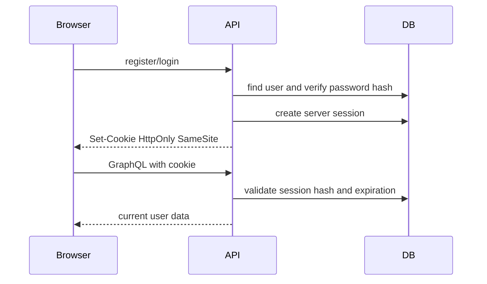
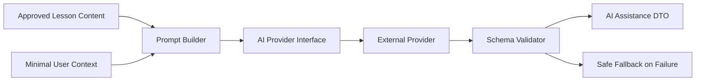

# System Architecture

## Architectural Style

The MVP uses a modular monolith: one frontend application, one backend application, one PostgreSQL database, and clear internal module boundaries. This keeps deployment simple while allowing domain modules to remain independently testable.

Do not introduce microservices for the MVP.

## System Context

## Containers

## Major Components

| Component | Responsibility |
| --- | --- |
| React Web App | Routes, forms, page states, accessible UI, Apollo queries and mutations. |
| GraphQL API | Typed application boundary for frontend operations. |
| Auth Module | Registration, login, logout, sessions, roles, CSRF, current user. |
| Content Module | Learning Tracks, Modules, Lessons, Lesson Versions, resources, approval workflow. |
| Planning Module | Enrollment, Study Plan, Study Weeks, Daily Tasks, deterministic scheduling and recovery. |
| Assessment Module | Weekly Assessment eligibility, attempts, answers, scoring, weak-topic detection. |
| Accountability Module | Invitations, Partner Connections, sharing permissions, progress views. |
| AI Module | Optional provider interface, prompt building, validation, redaction, fallback. |
| Observability | Structured logs, audit events, health checks, metrics, error reporting. |

## Request Flow

1. Browser sends GraphQL request with credentials included.
2. API validates CSRF for state-changing operations.
3. Auth guard resolves current session and user.
4. Resolver validates input shape and delegates to application service.
5. Application service enforces authorization and domain rules.
6. Repository or persistence service reads or writes PostgreSQL.
7. Service emits audit or domain event where needed.
8. Resolver returns DTO with only authorized fields.

## Data Flow

## Authentication Flow

## Scheduling Flow

1. Onboarding creates Enrollment and Study Plan.
2. Scheduler orders required lessons by module sequence and prerequisites.
3. Scheduler fills preferred study days without exceeding available minutes.
4. System marks incomplete past tasks MISSED.
5. Recovery algorithm moves missed lessons to recovery day, another available day, or delays dependents.
6. Important changes are stored in audit history and shown for learner review.

## Assessment Flow

1. Study Week closes or assessment day arrives.
2. Assessment service finds completed Daily Tasks with APPROVED Lesson Versions.
3. Service selects reviewed questions matching assessment tags.
4. Learner submits answers.
5. Objective questions score automatically.
6. Written and practical questions are marked manual unless approved AI-assisted feedback is enabled.
7. Weak-topic detector maps low scores to revision recommendations.

## AI Flow

AI calls are optional and isolated:

AI must not be required for scheduling, authorization, official curriculum changes, or objective grading.

## Deployment Topology

- Frontend: Vercel or equivalent static hosting.
- Backend: Railway, Render, Fly.io, or equivalent Node.js hosting.
- Database: managed PostgreSQL.
- CI: GitHub Actions.
- Monitoring: Sentry or equivalent plus provider logs.

The architecture remains vendor-neutral until deployment decisions are made.

## Failure Handling

| Failure | Handling |
| --- | --- |
| Database unavailable | API readiness fails; user sees retryable error. |
| Session expired | Return `AUTH_REQUIRED`; frontend redirects to login. |
| Scheduling conflict | Return reviewable conflict with explanation. |
| AI provider timeout | Return safe fallback; log redacted failure. |
| Assessment scoring error | Preserve submitted answers and mark attempt for retry or manual review. |
| Partner authorization failure | Return `AUTH_FORBIDDEN` without leaking resource existence. |
