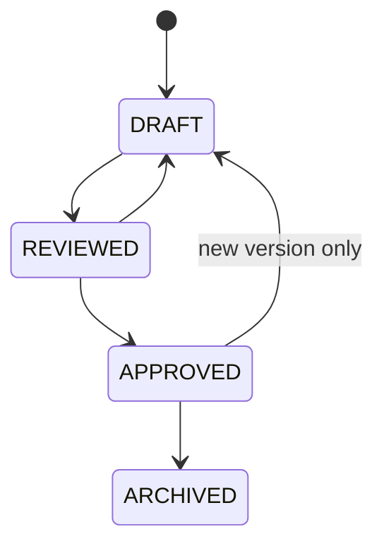

# Learning Content Model

## Overview

Reusable Lesson content is separate from scheduled Daily Tasks. A Lesson may have many Lesson Versions. Official scheduling uses only APPROVED Lesson Versions, and completed Task Attempts store snapshots so history remains stable.

## Lesson Structure

Every complete Lesson Version must include:

| Field | Required | Notes |
| --- | --- | --- |
| lessonIdentifier | Yes | Stable lesson ID such as `SE-W01-D01`. |
| title | Yes | Learner-facing title. |
| module | Yes | Parent Module. |
| track | Yes | Learning Track. |
| sequencePosition | Yes | Ordered within Module. |
| prerequisites | Yes | Empty list allowed. |
| difficulty | Yes | Beginner, intermediate, advanced, or track-specific scale. |
| estimatedDuration | Yes | Minutes. |
| requiredStatus | Yes | Required or optional. |
| learningObjective | Yes | One clear objective. |
| expectedOutcomes | Yes | Testable outcomes. |
| explanation | Yes | Complete teaching content. |
| professionalRelevance | Yes | Why topic matters. |
| examples | Yes | At least one concrete example. |
| guidedExercise | Yes | Step-by-step practice. |
| independentExercise | Yes | Unassisted practice. |
| knowledgeChecks | Yes | Short checks with answer keys. |
| commonMistakes | Yes | Specific pitfalls. |
| completionEvidence | Yes | What learner must submit. |
| assessmentTags | Yes | Stable topic tags. |
| resources | Yes | Approved additional resources. |
| contentStatus | Yes | DRAFT, REVIEWED, APPROVED, ARCHIVED. |
| contentVersion | Yes | Monotonic version number. |
| authoringMetadata | Yes | Author, reviewer, timestamps, notes. |

## Sections

Recommended order:

1. Overview
2. Learning objective
3. Expected outcomes
4. Explanation
5. Professional relevance
6. Examples
7. Guided exercise
8. Independent exercise
9. Knowledge checks
10. Common mistakes
11. Completion evidence
12. Approved resources

## Examples

Examples must be:

- directly connected to the objective;
- small enough to complete during the session;
- written for the track's context;
- accessible to screen readers when visual material is used;
- versioned with the Lesson Version.

## Exercises

| Exercise Type | Purpose | Evidence |
| --- | --- | --- |
| Guided | Practice with structure and hints. | Answers, artifact, code, or notes. |
| Independent | Prove transfer without step-by-step help. | Artifact or explanation. |
| Knowledge Check | Verify immediate recall or reasoning. | Selected or short answer. |
| Practical Assignment | Larger weekly or module task. | File, repository link, document, or written artifact. |

## Resources

Resources must include:

- title;
- URL or internal reference;
- resource type;
- required or optional flag;
- citation or source notes;
- approval state;
- accessibility warning if the resource has limitations.

## Review Status

Rules:

- DRAFT content can be edited.
- REVIEWED content awaits approval.
- APPROVED content is eligible for official scheduling and assessments.
- ARCHIVED content is not used for new official tasks.
- Editing APPROVED content creates a new DRAFT version.

## Snapshot Values

Task Attempt snapshots store:

- track title and type;
- module title;
- lesson identifier and title;
- Lesson Version ID and version;
- objective and outcomes;
- estimated duration and required flag;
- assessment tags;
- completion evidence schema;
- scheduled date and status at completion.

## Versioning

- Version numbers increment per Lesson.
- Only one Lesson Version should be current APPROVED for new scheduling unless an intentional transition window is documented.
- Historical Task Attempts remain linked to the Lesson Version and snapshot used at completion.
