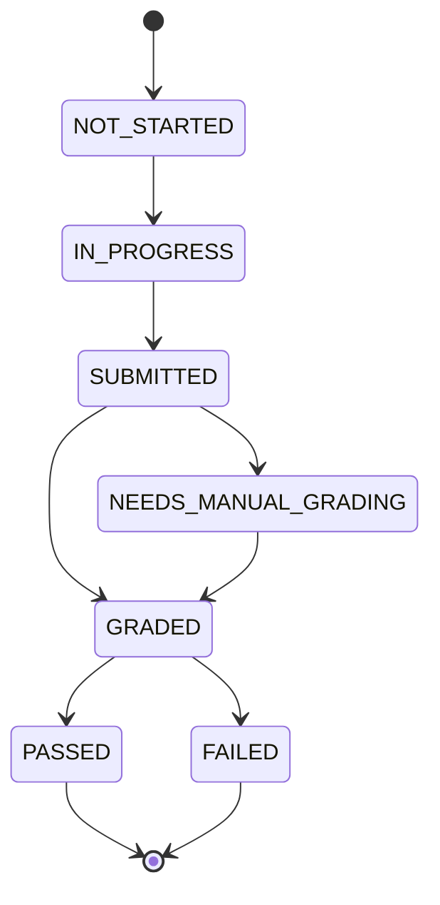

# Assessment Engine

## Purpose

Weekly Assessments verify understanding of lessons completed during a Study Week, detect weak topics, and recommend revision. MVP assessments should use predefined reviewed questions.

## Lifecycle

## Creation and Eligibility

An Assessment Attempt is eligible when:

- learner has an ACTIVE Enrollment;
- Study Week exists;
- at least one required Daily Task in the week is COMPLETED;
- completed lessons reference APPROVED Lesson Versions;
- a REVIEWED or APPROVED Assessment Version exists for the track;
- the learner has not exhausted configured retakes.

If no eligible content exists, return `ASSESSMENT_NOT_ELIGIBLE`.

## Question Selection

MVP selection is deterministic:

1. Collect assessment tags from completed approved lessons.
2. Select reviewed questions matching those tags.
3. Prefer required lesson tags over optional tags.
4. Include a mix of question types allowed for the track.
5. Keep total points within the assessment version rules.
6. Store selected question snapshots in the attempt.

## Supported Question Types

| Type | Answer Format | Auto-Scored |
| --- | --- | --- |
| Multiple choice | One option ID | Yes |
| Multiple select | List of option IDs | Yes |
| True or false | Boolean | Yes |
| Short written answer | Text | Manual or AI-assisted |
| Code challenge | Code text or repository link | Manual or test-assisted later |
| Debugging challenge | Explanation and fix | Manual |
| Scenario question | Text response | Manual |
| Case-study question | Text or artifact link | Manual |
| Practical assignment | Artifact link or upload reference | Manual |
| Reflection question | Text | Not part of pass score unless configured |

## Scoring

- Passing threshold default: 70%.
- Objective questions score from answer keys.
- Multiple select can use all-or-nothing or partial-credit rules configured per question.
- Manual questions store rubric and grader.
- AI-assisted feedback may suggest formative comments but cannot finalize production grades without review controls.

Phase 6 initially implemented predefined reviewed objective questions seeded from approved lesson assessment tags. The current Software Engineering seed also creates manual professional items for coding, debugging, architecture/design, interview answers, and revision reflection. Multiple choice, multiple select, and true/false questions are auto-scored; manual question types enter `NEEDS_MANUAL_GRADING` with nullable score outcome fields until a later review workflow exists.

Software Engineering weekly assessments are structured as professional checkpoints rather than simple quizzes: knowledge, concept explanation/application, coding challenge, debugging challenge, architecture/design case study, interview answer, and feedback/reflection. Assessment selection prefers an available mix of question types before filling the weekly question limit.

## Retakes

- MVP default: one retake per Weekly Assessment.
- Retake uses the same Assessment Version but can select alternate questions if configured.
- Historical attempts remain visible to the learner.
- Highest score and latest score are both stored for reporting.

Phase 6 stores each retake as a new `attempt_number` for the same learner, Study Week, and Assessment Version. A passed attempt prevents additional retakes.

## Answer Storage

Store:

- raw response JSON;
- question snapshot;
- score and feedback;
- grader type;
- timestamps;
- redacted AI metadata where used.

## Feedback

Assessment result shows:

- score earned and possible;
- percentage and pass/fail;
- per-topic feedback;
- weak topics;
- revision recommendations linked to lessons or tasks;
- manual grading pending states if applicable.
- owner-only per-answer response, earned/possible points, stored grading feedback, and manual-review state.

## German CEFR Assessment Rules

German assessments evaluate language performance across CEFR sublevels, not internal curriculum metadata. Weekly assessments should combine listening, reading, vocabulary, grammar in context, writing, speaking or speaking self-check evidence, and an integrated practical task where appropriate.

Every German sublevel from A1.1 through C2.2 ends with an internal integrated assessment. Results should report competency areas such as listening, reading, writing, speaking, interaction, mediation where relevant, and language control, with strong areas, needs review, and recommended next actions. These internal results must not be presented as official Goethe, telc, OeSD, VHS, or other external certification.

Every German assessment item maps to CEFR sublevel, module, competency, learning objective, difficulty, and content previously taught. Untaught content appears only when the item is explicitly measuring transfer or inference.

## Weak-Topic Detection

For each assessment tag:

1. Sum earned and possible points.
2. Mark weak if percentage is below 70% or if a required manual item is failed.
3. Recommend approved lessons with matching tags.
4. Prioritize prerequisite topics before advanced topics.

## Versioning and Integrity

- Assessment Versions are immutable once approved.
- Question changes create new versions or new questions.
- Submitted Assessment Attempts store snapshots.
- Deleting questions referenced by attempts is prohibited.
- Official assessments cannot include unapproved content.
