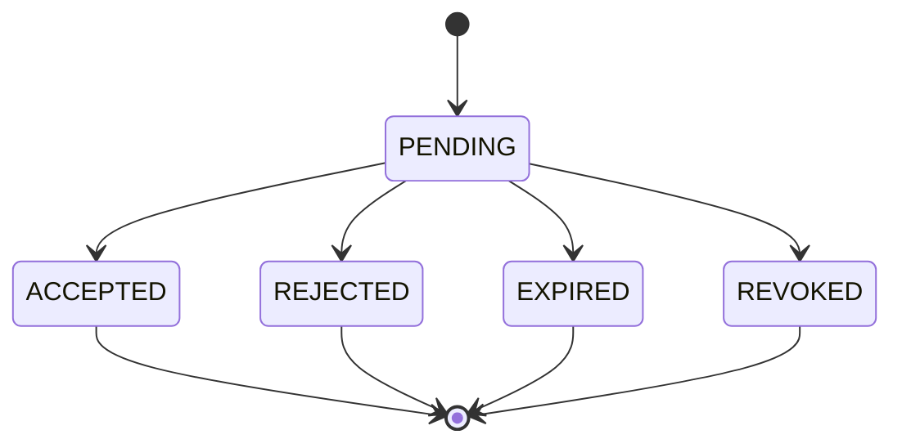

# Accountability System

## Purpose

Partner accountability should encourage cooperation and consistency without aggressive competition or privacy leakage.

## Visibility Model

Partners may see:

- planned study-session count;
- completed-session count;
- weekly completion percentage;
- current streak;
- whether a Weekly Assessment was completed;
- overall Learning Track progress;
- optional encouragement status;
- partner-visible reflections only when learner opts in.

Partners may not see:

- private notes;
- exact assessment answers;
- AI conversations;
- passwords or authentication data;
- personal information not explicitly shared;
- private reflections by default.

## Invitation Lifecycle



Rules:

- Invitations include inviter, invitee email, token hash, expiration, and status.
- Default expiration: 7 days.
- A blocked user cannot create a valid invitation.
- Accepting an invitation creates a Partner Connection.
- Rejected, expired, or revoked invitations cannot be accepted later.

Phase 7 implementation stores only a hashed invitation token, normalizes invitee email addresses, and lets an authenticated invitee accept or reject a pending invitation when their account email matches the invitation.

## Connection Removal

- Either user may remove a Partner Connection.
- Removal stops future sharing immediately.
- Historical audit event remains.
- Removed connections can be recreated only through a new invitation unless blocked.

## Blocking

- A user can block another user.
- Blocking revokes pending invitations from that user.
- Blocking removes active Partner Connections.
- The blocked user should not receive detailed reason or private state.

## Permissions

| Action | Allowed Actor |
| --- | --- |
| Send invitation | Authenticated learner |
| Revoke invitation | Inviter |
| Accept invitation | Invitee |
| Reject invitation | Invitee |
| View shared progress | Users in accepted Partner Connection |
| Remove connection | Either connected user |
| Block user | Any authenticated user |

## Shared Progress

Shared progress comes from `ProgressSnapshot`, not raw task attempts. The DTO must include only fields approved in this document.

Phase 7 exposes shared progress through `partnerDashboard`, `partnerInvitations`, `partnerConnections`, and `partnerProgress`. These operations do not expose private reflections, assessment answers, AI conversations, password or session data, or partner email addresses for active connections.

Example:

```json
{
  "plannedSessionCount": 5,
  "completedSessionCount": 4,
  "weeklyCompletionPercentage": 80,
  "currentStreak": 6,
  "assessmentCompleted": true,
  "overallTrackProgressPercentage": 12,
  "encouragementStatus": "OPEN_TO_CHECK_IN"
}
```

## Privacy Controls

- Reflections default to PRIVATE.
- Exact answers are never partner-visible.
- Partner dashboards must not expose hidden resource IDs that allow inference of private records.
- Authorization tests must cover both directions of each connection.

## Encouragement

Encouragement is supportive:

- "open to check-in";
- "needs quiet focus";
- "celebrating a completed week";
- "recovering a missed session".

Do not implement leaderboards, public rankings, shaming, or streak-loss punishment in the MVP.

## Abuse Prevention

- Rate-limit invitations.
- Allow blocking.
- Hide detailed account existence information in invitation flows where practical.
- Audit invitation acceptance, removal, and blocking.
- Provide safe empty states for users with no partners.
