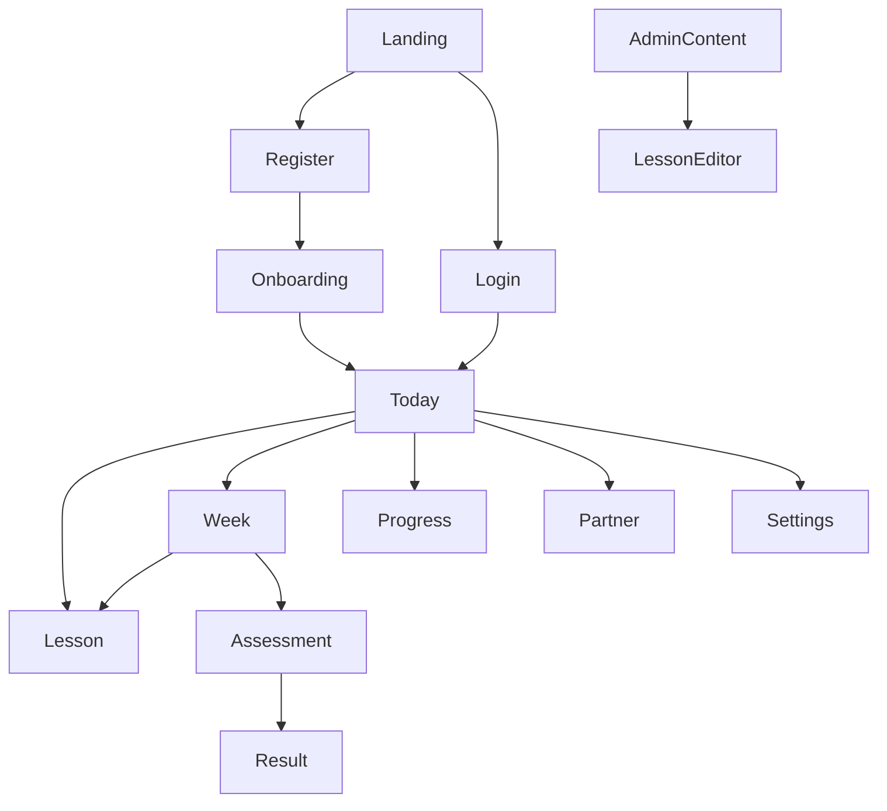

# UI/UX Specification

## UX Principles

- Put today's learning action first.
- Reduce planning decisions, not learner agency.
- Use supportive recovery language.
- Avoid guilt, shaming, public rankings, and streak punishment.
- Show progress as orientation and encouragement.
- Keep privacy choices understandable.
- Make every critical flow keyboard-accessible.

## Emotional Tone

The interface should feel calm, focused, and practical. Copy should say what happened, what is next, and how to recover. Avoid dramatic warnings for normal missed sessions.

## Navigation

Primary authenticated navigation:

- Today
- Week
- Roadmap
- Progress
- Partner
- Settings

Administrator navigation adds:

- Content
- Lesson Editor
- Assessment Questions

## Information Architecture

## Dashboard Hierarchy

The Today dashboard order is:

1. Today's main Learning Track Daily Task.
2. Today's German Daily Task if enrolled.
3. Estimated study time.
4. Current weekly progress.
5. Missed or overdue sessions with recovery action.
6. Next Weekly Assessment.
7. Partner progress summary.

The dashboard must not be a five-month calendar.

## Accessibility

- Use semantic HTML landmarks and headings.
- Use labeled form controls.
- Keep focus order logical.
- Provide visible focus states.
- Ensure status messages are announced.
- Provide non-color indicators for status and correctness.
- Keep contrast at WCAG 2.2 AA.
- Support reduced motion preference.

## Responsive Rules

- Mobile first from 360 px.
- Use a single-column dashboard on mobile.
- Weekly plan becomes stacked day sections on mobile.
- Avoid horizontal scrolling except for explicitly labeled data tables.
- Keep primary action visible without hiding essential context.

## Empty States

| Area | Empty State |
| --- | --- |
| No Enrollment | Prompt to complete onboarding. |
| No task today | Show next scheduled task and roadmap link. |
| No partner | Invite partner action with privacy summary. |
| No assessment | Explain eligibility and next assessment date. |
| No admin content | Prompt admin to create first draft. |

## Loading States

- Use skeletons for dashboard and page layout.
- Use button loading state for mutations.
- Preserve form input while mutation is pending.
- Avoid replacing long lesson content with full-page spinners after initial load.

## Error States

- Validation errors appear next to fields.
- Permission errors explain that the page is not available.
- Session expiration redirects to login with return path.
- Recovery conflicts explain why automatic scheduling was not possible.
- AI errors never block lesson completion.

## Success Feedback

- Lesson completion confirms evidence was saved and shows next task.
- Recovery acceptance summarizes changed dates.
- Assessment submission confirms grading status.
- Partner invitation success shows expiration and next step.

## Professional Lesson Experience

- Orient the learner with track, module, current lesson, objective, duration, status, and session stages before the lesson body.
- Present substantial concepts as learn, worked example, guided practice, independent practice, feedback, and retrieval.
- Keep answer keys and solution notes behind learner-controlled disclosure.
- Use semantic code blocks and horizontally scrollable data tables at narrow widths.
- Give every session explicit links to Today, the weekly plan, Roadmap, and My Tracks.
- Keep the primary reading column near 48rem so long technical explanations remain readable.
- On wide desktop screens, let the lesson workspace and completion panel use the available viewport while keeping individual prose blocks near 75 characters per line.
- Present independent practice as one core task with short steps, useful language, explicit evidence, and clearly optional extension work; do not combine every duration route into one paragraph.
- Divide substantial lesson explanations into visually distinct, named activity sections with duration, lists, and styled language examples instead of uninterrupted prose.
- Let lesson headings, explanations, lists, and activity blocks use the full content panel on wide screens, with larger body type and section spacing to preserve readability.
- Use the full workspace for the weekly plan. Show task status with both text and accessible color treatment: green completed, neutral planned, blue in progress, red missed, and muted skipped, cancelled, or rescheduled.

## Missed-Session Experience

Use language such as:

- "This session was missed. Choose a recovery option."
- "Your completed work is preserved."
- "This change keeps prerequisites in order."

Do not use guilt-based copy such as "failed", "lost", or "broken streak" for normal missed sessions.

## Assessment Experience

- Show progress through questions.
- Save answers locally or server-side as appropriate before submission.
- Clearly mark manual grading pending.
- Explain weak topics and revision recommendations.

## Accountability Experience

- Emphasize support over comparison.
- Use private defaults.
- Show exactly what a partner can see before invitation.
- Provide remove and block actions in settings or partner page.
