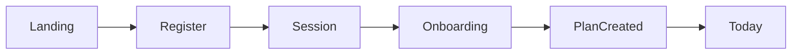
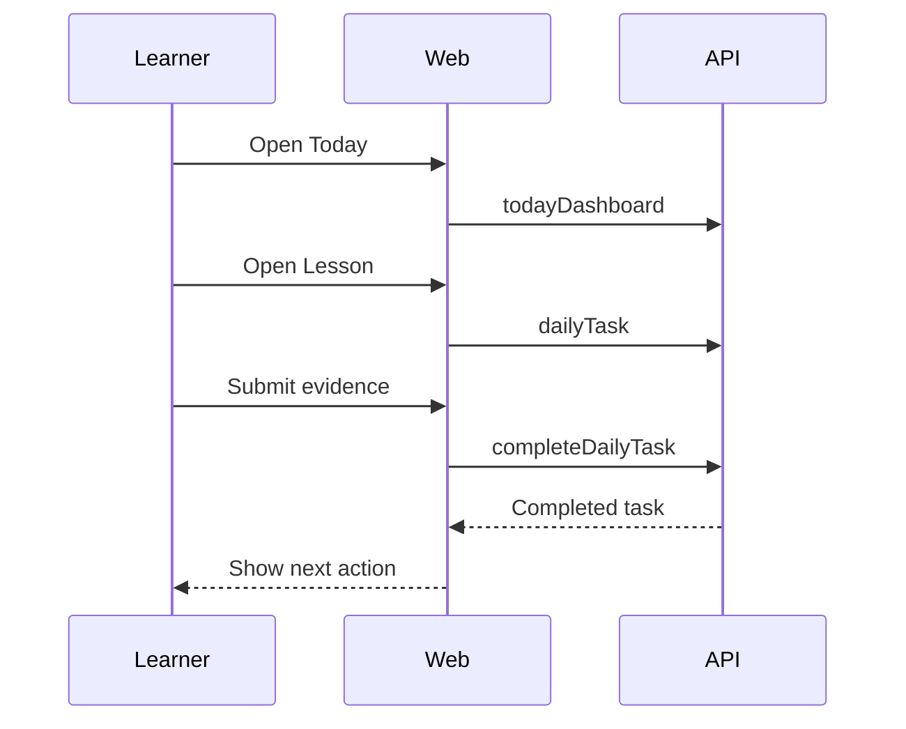
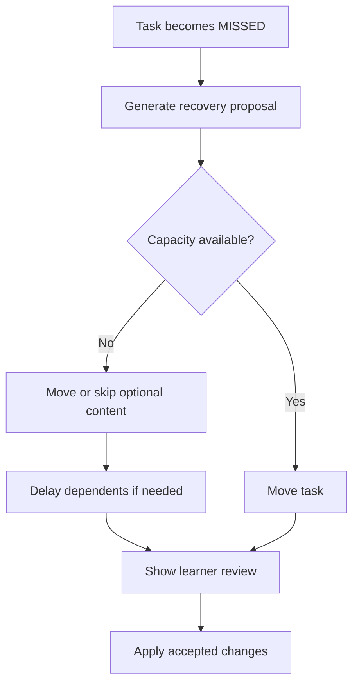
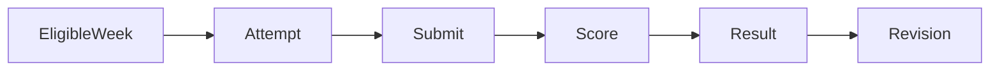
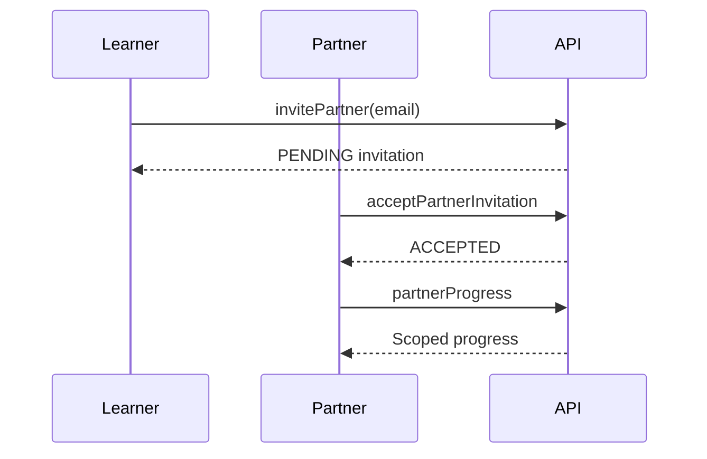
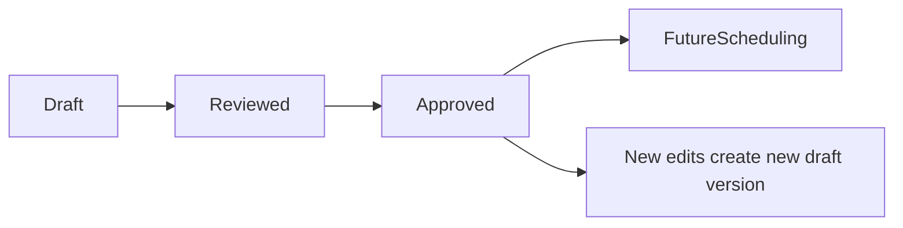

# User Flows

## Registration and Onboarding

1. Visitor opens landing page.
2. Visitor selects registration.
3. Visitor enters email, password, display name, and time zone.
4. System creates user and secure session.
5. Learner selects Learning Track and schedule preferences.
6. System validates capacity and creates Enrollment, Study Plan, Study Weeks, and Daily Tasks.
7. Learner lands on Today dashboard.

## Daily Lesson Completion

1. Learner opens Today dashboard.
2. Learner starts the main Daily Task.
3. System shows scheduled Lesson snapshot.
4. Learner reads explanation, completes exercises and checks.
5. Learner submits duration, completion evidence, and optional Learning Reflection.
6. System stores Task Attempt and marks Daily Task COMPLETED.
7. Dashboard updates progress and next action.

## Missed-Session Recovery

1. System marks past incomplete tasks MISSED.
2. Learner sees missed task on Today dashboard.
3. Learner requests recovery.
4. Scheduler returns proposal with reason and affected tasks.
5. Learner accepts or chooses another valid option.
6. System updates future tasks and writes audit event.

## Weekly Assessment

1. Assessment day arrives or learner opens eligible Study Week.
2. System checks completed approved lessons.
3. System creates Assessment Attempt from reviewed question bank.
4. Learner submits answers.
5. System scores objective questions and flags manual items.
6. Learner sees result or manual-grading pending state.
7. Weak topics produce revision recommendations.

## Partner Invitation

1. Learner opens Partner page.
2. Learner reviews visibility summary.
3. Learner sends invitation by email.
4. Invitee accepts before expiration.
5. System creates Partner Connection.
6. Partner sees shared progress summary only.

## Admin Content Approval

1. Content Administrator creates Lesson Version draft.
2. Administrator completes required fields, exercises, resources, and tags.
3. Administrator submits for review.
4. Reviewer approves content.
5. Approved version becomes eligible for future scheduling and official assessments.
6. Existing completed attempts remain unchanged.

## AI Assistance

1. Learner requests alternate explanation.
2. System verifies AI is enabled and Lesson Version is approved.
3. Prompt builder includes only approved content and minimal context.
4. Provider response is schema-validated.
5. Valid response is shown; invalid or failed response becomes safe fallback.

AI flow never blocks deterministic task completion.
