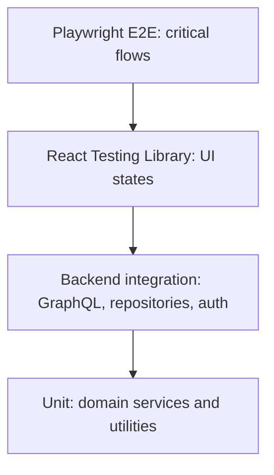

# Testing Strategy

## Test Pyramid



Most tests should be unit and integration tests. E2E tests cover the few flows that must never break.

## Unit Tests

Cover:

- scheduling capacity and recovery algorithms;
- prerequisite ordering;
- assessment eligibility;
- objective scoring;
- weak-topic detection;
- partner visibility filtering;
- email normalization;
- error mapping.

## Integration Tests

Cover:

- Prisma repositories and constraints;
- transactional task completion;
- onboarding plan creation;
- assessment submission and scoring;
- partner invitation acceptance;
- admin content approval;
- session creation and revocation.

## GraphQL Tests

For each operation:

- authenticated success;
- unauthenticated failure where required;
- forbidden access to another user's resource;
- validation failure;
- expected side effects;
- stable error code.

## Repository Tests

Use test database fixtures. Verify:

- unique constraints;
- foreign keys;
- enum persistence;
- snapshot writes;
- query indexes through query plans only when performance risk justifies it.

## Scheduling Tests

Required scenarios:

- create initial plan with five study days;
- reject capacity-overloaded preferences;
- mark missed tasks idempotently;
- move missed task to recovery day;
- delay dependent lesson when prerequisite is missed;
- skip optional content before delaying required content;
- pause and resume without moving completed tasks;
- daylight-saving boundary date handling.

## Authorization Tests

Required scenarios:

- learner cannot access another learner's Daily Task;
- partner can view scoped progress only;
- partner cannot view exact assessment answers;
- content admin can approve content;
- learner cannot call admin mutations;
- disabled user session is rejected.

## Component Tests

Cover:

- registration and login forms;
- onboarding schedule validation;
- Today dashboard states;
- Lesson completion evidence form;
- Weekly Plan status rendering;
- Assessment controls and validation;
- Partner invitation and empty state;
- Admin lesson editor required fields.

## Accessibility Tests

- Automated axe checks for core pages.
- Manual keyboard path for registration, onboarding, lesson completion, assessment, and partner invitation.
- Screen-reader labels for form controls and progress indicators.
- Contrast verification for semantic states.

## End-to-End Tests

Critical Playwright flows:

1. Register, onboard, and land on Today dashboard.
2. Complete a daily lesson and see progress update.
3. Miss a task and apply recovery.
4. Complete Weekly Assessment and view result.
5. Invite partner, accept invitation, view shared progress.
6. Content admin approves a Lesson Version.

## Fixtures and Test Data

- Use deterministic seed users with safe development credentials only.
- Seed all three Learning Tracks.
- Seed four weeks of representative curriculum.
- Seed completed, missed, and future tasks.
- Seed partner connection and pending invitation.

## Mocking Rules

- Mock external AI provider at provider interface.
- Mock email provider at adapter boundary.
- Do not mock domain services in integration tests that validate business rules.
- Keep frontend GraphQL mocks aligned with schema.

## CI Gates

Required before merge once implementation exists:

```bash
pnpm lint
pnpm typecheck
pnpm test
pnpm build
```

E2E may run on pull requests or protected branch depending on duration.

## Coverage Expectations

- 90% or higher coverage for scheduling and assessment domain services.
- 80% or higher coverage for backend application services.
- Component tests for every critical page state.
- Coverage thresholds should not encourage low-value tests over critical behavior.

## Critical Test Scenarios

- Historical snapshots remain unchanged after content version updates.
- Official assessment excludes unapproved content.
- Completed tasks are never automatically rescheduled.
- Daily capacity is respected.
- Partner privacy is enforced.
- AI provider failure does not block core workflows.
- Gold-standard professional sessions include teaching, a complete example, guided checkpoints, success criteria, independent practice, and explanatory feedback.
- Learning content preserves code and table semantics at desktop and mobile widths.
- Run `pnpm audit:learning-experience` to flag suspicious professional sessions; manually review representative flagged and unflagged sessions because text heuristics cannot prove instructional quality.
