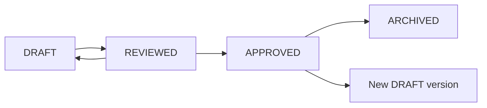

# Content Authoring Guide

## Lesson-Writing Rules

- Write for a single clear session.
- Include every required Lesson Version field from [17 Learning Content Model](17-learning-content-model.md).
- Keep the explanation complete enough that the learner does not need to search externally.
- Use approved resources as supplements, not as the core lesson.
- Tie exercises directly to the learning objective.
- Include completion evidence that can be checked later.

## Objective-Writing Rules

Objectives must be:

- learner-centered;
- observable;
- specific to one lesson;
- testable in an exercise or assessment.

Use verbs such as explain, implement, compare, design, diagnose, draft, assess, or justify.

Avoid vague objectives such as "understand TypeScript" or "learn project planning."

## Explanation Style

- Start with the practical reason the topic matters.
- Define key terms before using them.
- Use examples close to the track context.
- Include common mistakes and how to avoid them.
- Keep advanced caveats separate from required MVP learning.

## Exercise Style

Guided exercises:

- include steps;
- include hints where useful;
- end with a concrete artifact.

Independent exercises:

- require transfer without step-by-step instructions;
- define expected evidence;
- include assessment tags.

## Resource Requirements

Each resource must include:

- title;
- URL or internal reference;
- type;
- required or optional flag;
- reason for inclusion;
- citation notes;
- accessibility caveats if any.

Do not approve resources that are unstable, inaccessible, or inconsistent with the lesson unless the caveat is explicit.

## Citation Requirements

- Cite external resources by title, organization or author, and URL.
- Record access date during content review when useful.
- Do not copy large third-party content into lessons.
- Prefer official documentation for technical topics.

## Code-Example Rules

- Use TypeScript for MVP engineering code unless a JavaScript comparison is required.
- Keep examples small and runnable.
- Avoid `any`.
- Show validation for external input.
- Avoid fake secrets or real credentials.
- Include accessibility considerations for UI examples.

## Accessibility

- Provide alt text or text alternatives for images and diagrams.
- Do not rely on color alone.
- Keep tables simple and labeled.
- Ensure exercises can be completed without inaccessible media.

## Bias and Inclusion

- Avoid stereotypes in scenarios.
- Use diverse names and contexts without making identity the subject.
- Avoid shame-based language for missed work.
- Keep examples professionally relevant and respectful.

## Review Workflow

## Approval Checklist

- Objective is testable.
- Lesson contains explanation, examples, guided exercise, independent exercise, knowledge checks, mistakes, evidence, tags, and resources.
- Resources are trusted and cited.
- Assessment tags match question bank taxonomy.
- Content follows accessibility rules.
- No future-scope feature is required.
- No unlicensed copied material is included.

## Versioning

- Editing approved content creates a new DRAFT version.
- Approved versions remain available for historical snapshots.
- Archived versions are not scheduled for new tasks.
- Version notes should explain material changes.

## Archival

Archive when:

- content is outdated;
- resource links are unsafe or broken;
- curriculum sequence changes;
- assessment tags are replaced.

Archival must not remove historical learner evidence.
